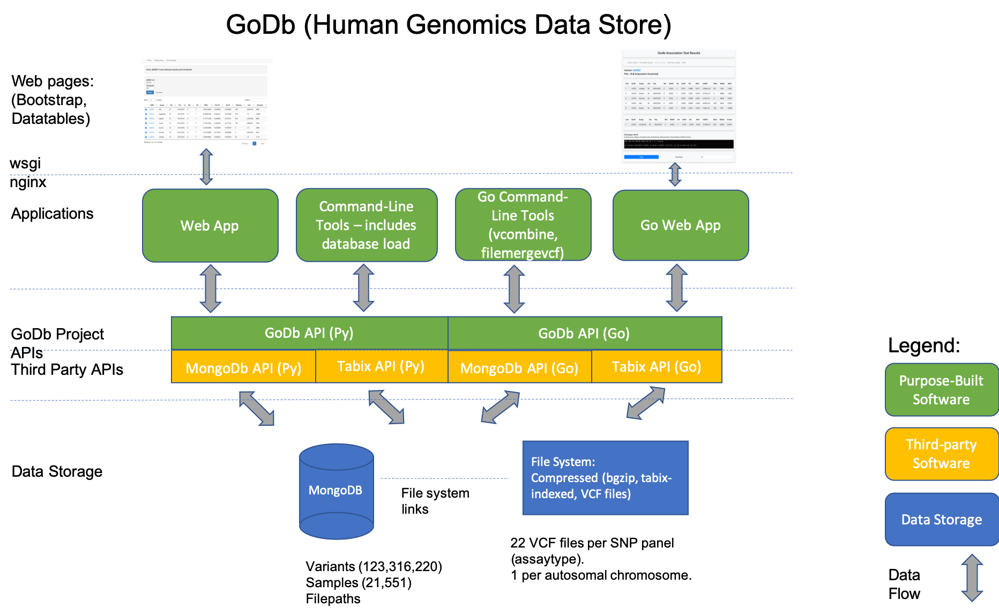

# GoDb - a simple, hybrid data store system for multiple SNP panels (assays)
## Background
For single institution bio-resources genotyping of subjects may have taken place over a period of some years and on differing SNP assay platforms (resulting in data referered to as belonging to different *SNP panels* or *assaytype*s). Genotype data sets reside in file system files, possibly in different genotype formats (PLINK BED, Oxford .gen or VCF, for example).


## Requirements
The over-arching requirement was the provision of a simple data management architecture and the software to bring together multi SNP panel genomic data for a single cohort.

### Functional
Some additional functional requirements were set out at the start of the project:
* Curation of genomic data from multiple SNP panels.
* Provision of the means to query data using well-known SNP identifiers (dbSNP rsids). 
* Maximising samples size via the automatic combination of genotype records across assay platforms, resolving overlaps in sample sets on demand.
* Adding genotype data from new assays as they become available.   
 
### Non-Functional
Two non-functional requirements were also identified:
* Operate in an environment where compute resources may be limited.
* Allow for scaling up of the size of the data, in particular sample-size, with little performance degradation   

## Description
The data store was designed and built using MongoDb to hold collections of variant, sample and file location data, with genotype data retained in VCF files.

Software was developed to take advantage of the rapid access times offered by both MongoDb for storing variant id (rsid) vs genomic co-ordininates, and tabix indexing for random access to compressed VCF files via genomic co-ordinates. This includes a web application to allow querying of the data store by variant_id and lists of variant ids and command line tools for bulk data extract.

### This repository 
The following subdirectories are in the repository:

- *cfg/* Config files containing environment variables to locate data, software and the MongoDb database host 

- *load/py/* Python scripts to load the data store.

- *load/pl/* Single perl script for data directory navigation and variant load script execution

- *load/pm/* Perl modules for data directory navigation

- *load/sh/* Data store load bash wrapper scripts.

- *webapp/* All Python code, templates, java script, css and image files related to the web application.

- *extract/py/* Command-line Python code for genotype data extract, from lists of SNPs. 

- *extract/src/* Root directory for Go(lang) source code to build a multi-threaded command-line extract tool. There is also library code to handle MongoDb and tabix-indexed file access.

- *extract/sh/* bash scripts, wrappers for command-line extract tools.

- *lib/py/* Python library code, including the python godb API layer and VCFrecord field access.

### Running database load scripts
Scripts located in *load/sh*, *load/py* and *load/pl*.
All scripts rely on the files in the *cfg* directory to find both data and the MongoDb database, there are examples for five ddifferent assay platforms in the *cfg* directory.

Once the cfg files are set up and, assuming the MongoDb collections listed in the next section are either non-existent or empty with all indexes dropped three scripts can be run from the *load/sh* directory:

- load_variants.sh \<full path to assay platform cfg file\> 

- load_samples.sh \<full path to assay platform cfg file\> 

- load_filepaths.sh \<full path to assay platform cfg file\> 


### MongoDb Collections - example documents
variants - one document per variant per SNP panel (assaytype):
```
{
	"_id" : ObjectId("5dee1245d5d298277178bcfb"),
	"assaytype" : "metabo",
	"ref_maf" : 0.6,
	"rsid" : "rs7294904",
	"info" : 1,
	"alleleB" : "C",
	"position" : 199532,
	"alleleA" : "T",
	"chromosome" : "12"
}
```

samples - one document per sample per SNP panel (assaytype):
```
{
	"_id" : ObjectId("5decf26e64b5031da4b9c5cd"),
	"assaytype" : "affy",
	"list_posn" : 0,
	"sample_id" : "006561"
}
```

filepaths - one document per SNP panel (assaytype):
```
{
	"_id" : ObjectId("5decf307339f134beefc2419"),
	"assaytype" : "affy",
	"files" : [
		{
			"CHROM" : "12",
			"filename" : "chr12.vcf.gz"
		},
		{
			"CHROM" : "02",
			"filename" : "chr02.vcf.gz"
		},
		{
			"CHROM" : "06",
			"filename" : "chr06.vcf.gz"
		},
		{
			"CHROM" : "22",
			"filename" : "chr22.vcf.gz"
		},
		{
			"CHROM" : "01",
			"filename" : "chr01.vcf.gz"
		},
		{
			"CHROM" : "19",
			"filename" : "chr19.vcf.gz"
		}
	],
	"fpath_prefix" : "<data root>/godb",
	"filepath" : "<data root>/affy/",
	"fpath_suffix" : "affy/"
}
```

## Dependencies
- MongoDb community edition (version 3 upwards, tested to 4.2.1)
- Tabix (0.2.5)
- pysam python library (0.15.3)
- pymongo python library (3.9.0)
- gopkg.in/mgo.v2 golang library
- gopkg.in/mgo.v2/bson golang library
- github.com/brentp/bix golang library for tabix index access
- github.com/brentp/irelate/intercases golang library for tabix index access

## Data Store Architecture 
High-level architecture diagram of the data store and software, showing application level, godb library and third-party library layers.




## Combining genotype records 
Genotype records are combined in both Python and Golang code, with sample overlaps resolved according to the indicated genotype resolution rules.


## Ackowledgments

